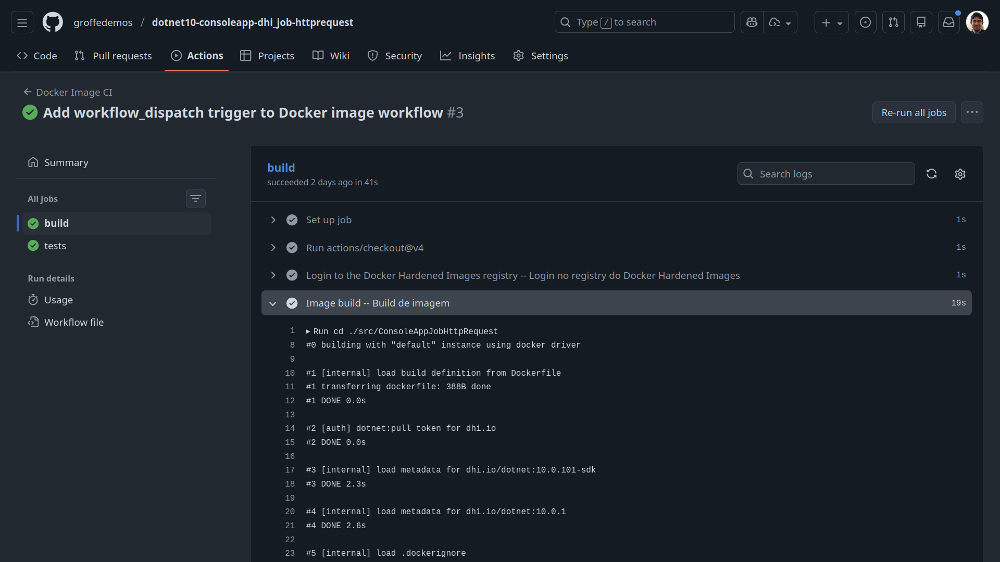
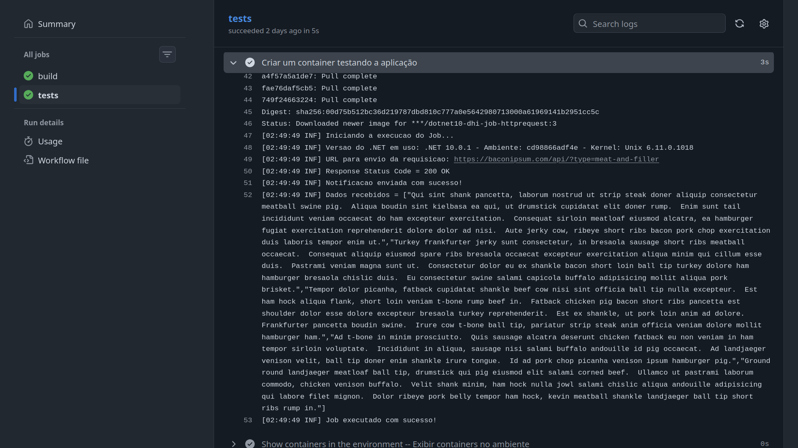

# githubactions-docker-hardened-images-build
Workflow do GitHub Actions para build de imagens baseadas em Docker Hardened Images (DHI).

Aplicação utilizada nos testes: https://github.com/groffedemos/dotnet10-consoleapp-dhi_job-httprequest

## Testes com este workflow

Execução de build com pull de imagens do .NET 10 que estão no container registry do Docker Hardened Images:

Testes com o container criado a partir das imagem (está como pública no Docker Hub - **renatogroffe/dotnet10-dhi-job-httprequest:3**):

